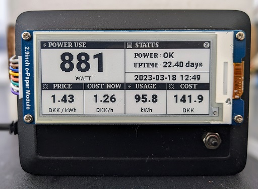
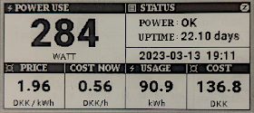
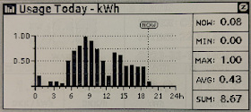
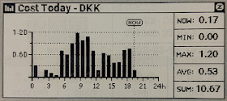

ESPHome Power Meter w/ E-Ink Display
====================================

This is the 'extended' version of my ESPHome Power Meter. This version adds an E-Ink Display and a humble push button. The button enables turning pages on the display manually. Main page is a - sort of - status page and the subsequent pages shows some graphs and stuff.  To make it easier for myself - not wanting to draw every single line on the display - I've created some transparent backgrounds in GIMP, and just pop those on the display before drawing the rest.

I've removed the Power LED from the setup, as I don't feel a need for a LED when we have a display.

It has the same sensors and configuration in HA as the basic version.

I shoved it all into a Raspberry Pi case, I had lying around:

Here's some examples of the pages on the E-Ink Display:

#### Status Page ####

#### Daily Usage Graph ####

#### Daily Cost Graph ####

## Notes
* The display code is quite messy and really should be rewritten.
* Put the pictures from the images folder in the ESPHome folder before installing.
* Achieving transparency when drawing images on E-Ink Displays in ESPHome can be tricky. If a pixel is anything other than 100% transparent, it will turn up black on the display. I'm not sure if it was a fault of mine or a quirk of GIMP, but I was exporting PNGs from GIMP that should've be 100% transparent, and looked it to the naked eye, but were apparently not 100% and turned up black on the display.

Components
-----------

* An ESP32. Any ESP32 should work. An ESP8266 *might* work, but you'll have fewer pins available.
* [LM393 Photodiode Sensor module](https://www.mysensors.org/build/light-lm393)
* [Waveshare 2.9" E-Ink Display](https://www.waveshare.com/2.9inch-e-paper-module.htm)
* [Push Button](https://www.switchelectronics.co.uk/black-microminiature-5mm-momentary-off-on-push-button-spst-0-5a)

Wiring
-------

#### Waveshare E-Ink Display ####
| DISPLAY | ESP32 |
|--------:|-------|
|   BUSY  |   19  |
|    RST  |   16  |
|    DC   |   17  |
|    CS   |    5  |
|   CLK   |   18  |
|   DIN   |   23  |
|   GND   |  GND  |
|   VCC   |  3.3v |

#### LM393 Photodiode Module ####
| MODULE | ESP32 |
|-------:|-------|
|    D0  |   26  |
|    A0  |   NC  |
|   VCC  |  VCC  |
|   GND  |  GND  |

#### Push Button ####
|  PIN | ESP32 |
|-----:|-------|
|   1  |  GND  |
|   2  |   25  |
