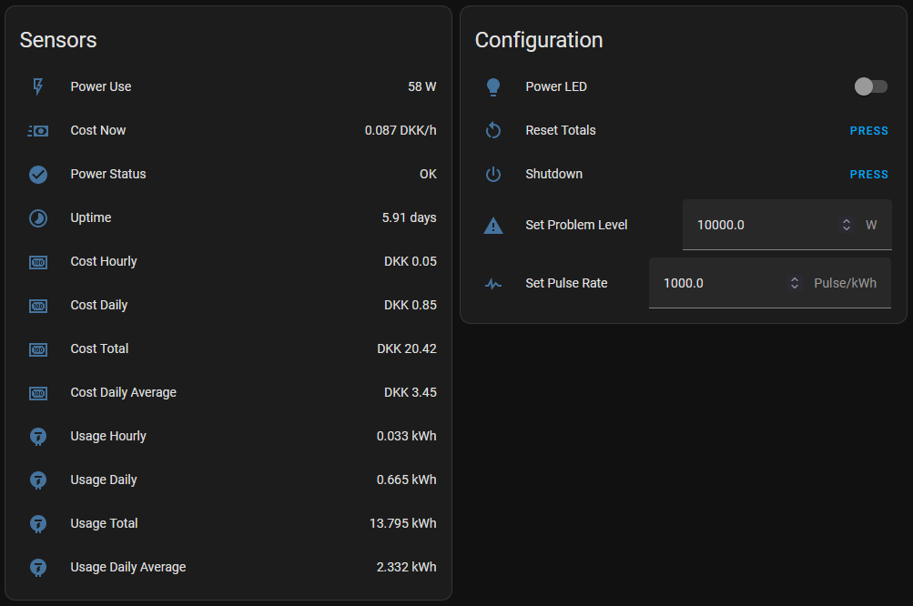

ESPHome Power Meter
====================

### Yet another version of a non-invasive Power Meter for use in [Home Assistant](https://www.home-assistant.io/), using the [Pulse Meter](https://esphome.io/components/sensor/pulse_meter.html) component in [ESPHome](https://esphome.io/). ###

I've used [Home Assistant Glow](https://github.com/klaasnicolaas/home-assistant-glow) for a while without problems. I decided that it would be cool to also have the ESP track costs as well. That way I could do away with Rieman Sum and Utility Meter integrations in HA. This is the result of having that initial idea and a lot of hammering on the keyboard.

The kWh price is imported as a sensor from Home Assistant, which is running the [Nordpool Custom Component](https://github.com/custom-components/nordpool), but the price can also be set 'manually' with a Number component. Ideally the price should be fetched directly from NordPool using their API.

I have had some weird power spikes (faulty photodiode, it turned out), so I included a **Power Problem Level** number and a **Power Problem Status** binary sensor in the ESPHome config. You set the level and subsequently, if power consumption goes over (or equals) the level, the binary sensor will indicate that you have a problem. The history in HA of this sensor was very useful to track the problem I had, so I have left it in.

I have also included a RGB led which, instead of blinking (I do not like blinking LEDs), will indicate power consumption level in relation to the set power problem level. Turn it on, set the brightness and the color will be set automatically at each power pulse.

To test the accuracy of the Power Meter, I created a simple Arduino Sketch to simulate the blinking LED on a 'real' Power Meter. A simple LED blinking at specific intervals to simulate power consumption. You'll find it [here](https://github.com/zenzay/arduino-projects/tree/main/power-meter-pulse-led). I also disabled the kWh Price sensor import from HA, temporarily in the code, so the price stayed fixed during testing.

#### Disclaimer

* This was made just for fun, to see what you could accomplish in an ESPHome configuration, using Globals and Lambdas *all over the place*.
* If this was to have any proper value, it should probably be in the form of a ESPHome Custom Component.
* This hasn't been tested extensively and I take absolutely no responsibility for any suprisingly large electricity bills.

## HA Example Cards ##

Note: Hourly have been changed to Monthly in latest version.

Components
-----------

* An ESP32. I'm using a nodemcu-32s, but any ESP32 should do. An ESP8266 *might* work too, if you change pin designations.
* [LM393 Photodiode Sensor module](https://www.mysensors.org/build/light-lm393)
* [WS2818 LED](https://randomnerdtutorials.com/guide-for-ws2812b-addressable-rgb-led-strip-with-arduino/)

Wiring
-------

#### LM393 Photodiode module ####
| MODULE | ESP32 |
|-------:|-------|
|    D0  |   26  |
|    A0  |   NC  |
|   VCC  |  VCC  |
|   GND  |  GND  |

#### WS2818 LED ####
| LED  | ESP32 |
|-----:|-------|
|   D0 |   17  |
|  VCC |  VCC  |
|  GND |  GND  |

